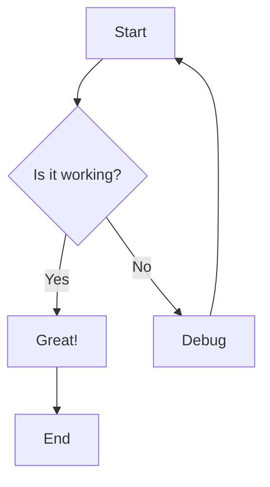
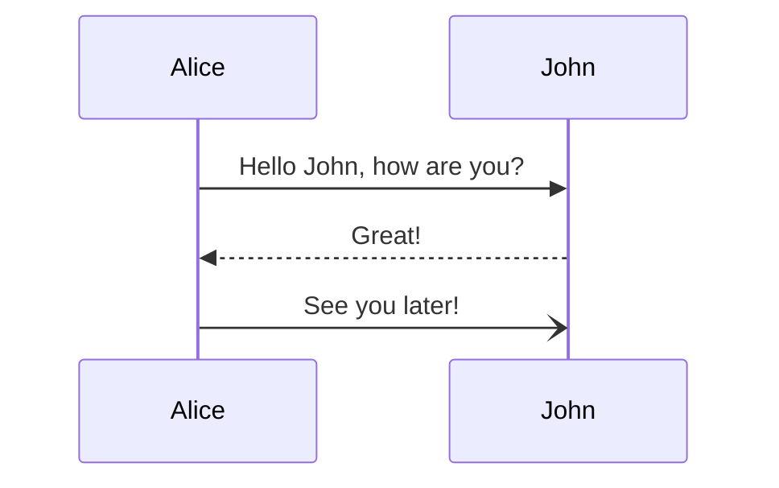
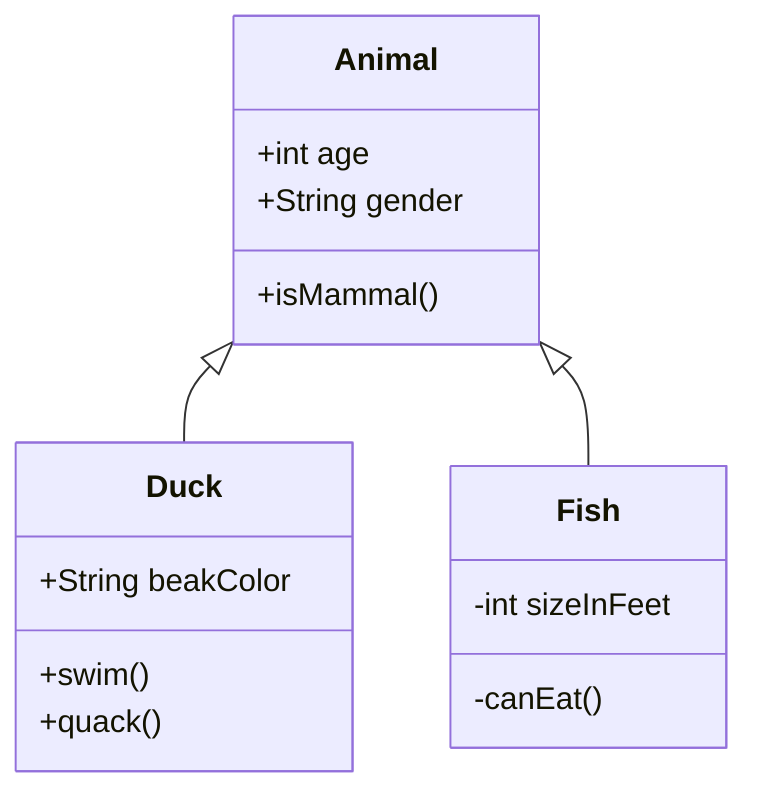
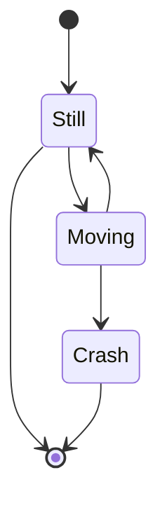

# Test Mermaid Diagrams

## Test 1: Simple Flowchart



## Test 2: Sequence Diagram



## Test 3: Class Diagram



## Test 4: State Diagram



## How to Test

1. Open this file in Zed
2. Copy one of the diagram blocks (the text between ```mermaid and ```)
3. In Zed's Assistant panel, type:
   `/mermaid-preview <paste diagram here>`
4. The extension will render the diagram and give you a file path
5. Open the file path to see the SVG preview

## Expected Output

You should see a message like:
```
✅ Diagram rendered successfully

Preview: /Users/wfukatsu/.cache/zed/mermaid/abc123...svg

Open with your system viewer.
```

Then you can open that file with:
```bash
open /Users/wfukatsu/.cache/zed/mermaid/abc123...svg
```
